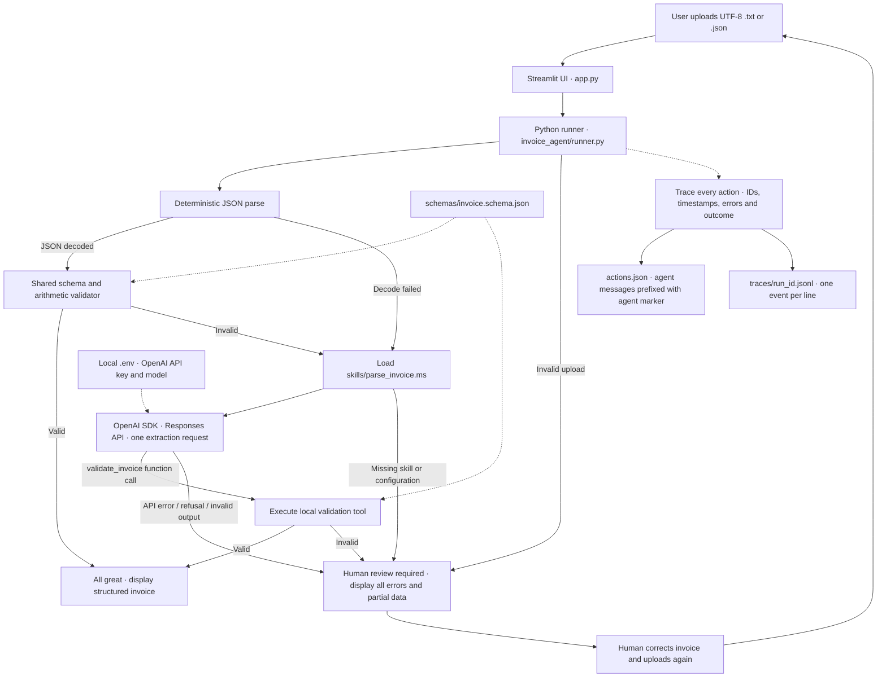

# Invoice agent architecture

[Open the standalone architecture SVG](docs/architecture.svg).

| Component | Responsibility |
| --- | --- |
| `app.py` | Upload, result/error display, local human-review handoff, downloads |
| `invoice_agent/runner.py` | Bounded JSON-first workflow, skill loading, model call, tool dispatch |
| `invoice_agent/schema.py` | Strict JSON decoding, schema checks, Decimal arithmetic |
| `schemas/invoice.schema.json` | Shared invoice contract for the validator and model prompt |
| `skills/parse_invoice.ms` | Lazy-loaded extraction instructions; missing data stays missing |
| `invoice_agent/tracing.py` | Shared actions array and one JSONL trace per run; credential redaction |
| `invoice_agent/config.py` | Read local `.env`; never log the API key |
| `scripts/demo.py` | Exercise real synthetic invoices and save reviewable traces |
| `scripts/package.py` | Build an allowlisted source ZIP, excluding secrets and user logs |

Only the semantic step uses the network. Valid structured JSON runs entirely
locally. The model requests the validation tool, but cannot declare success or
edit files. The validator's outcome determines the UI message. No second LLM
request is needed after tool execution. Earlier errors remain visible, including
errors recovered by the fallback. Human review is local and does not contact an
external person or service.

The exact agent prefix in action messages is `[agent]`. The `.jsonl` trace and
`actions.json` contain the same event objects, linked by `run_id` and `sequence`.
The shared JSON array is intended for this small local app; it is rewritten on
each action. A larger deployment would use durable storage and a review queue.
